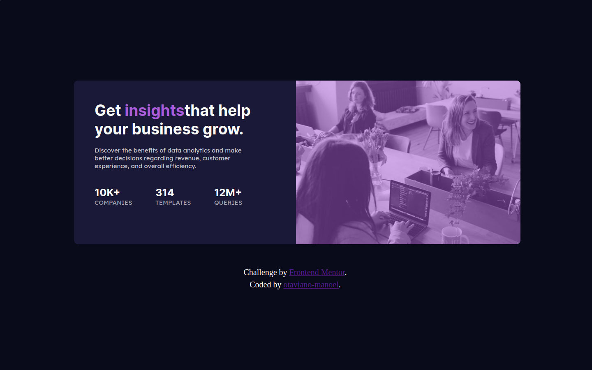

# Frontend Mentor - Stats preview card component solution

This is a solution to the [Stats preview card component challenge on Frontend Mentor](https://www.frontendmentor.io/challenges/stats-preview-card-component-8JqbgoU62). Frontend Mentor challenges help you improve your coding skills by building realistic projects. 

## Table of contents

- [Overview](#overview)
  - [The challenge](#the-challenge)
  - [Screenshot](#screenshot)
  - [Links](#links)
- [My process](#my-process)
  - [Built with](#built-with)
  - [What I learned](#what-i-learned)
  - [Continued development](#continued-development)
  - [Useful resources](#useful-resources)
- [Author](#author)

## Overview

### The challenge

Users should be able to:

- View the optimal layout for the site depending on their device's screen size

### Screenshot




### Links

- Solution URL: [Solution URL here](https://www.frontendmentor.io/solutions/page-responsive-f1Ocqj0Slp)
- Live Site URL: [Live site URL here](https://otaviano-manoel.github.io/stats-card-Responsividade/)

## My process

### Built with

<code></code>
<code></code>


### What I learned

For this challenge, I aimed to achieve good results in the area of responsiveness. Responsiveness is the website's ability to adapt to various screen resolutions. The card created in the project adjusts to resolutions for both mobile and desktop, providing a seamless user experience.


Here, I am applying a different styling to the website when the device has a maximum width of 1100px.
```css
@media (max-width: 1100px) {
  /**Nova estilizaçao**/
}
```

Looking at my results, I believe I achieved what I expected in terms of the responsiveness of this site, but I know I need to practice more.

### Continued development

In my next challenge, I will apply the `display: grid` to create grids and arrange objects in rows and columns.

### Useful resources
- [W3Schools](https://www.w3schools.com/css/default.asp) - 
I used W3Schools to clarify my doubts and I really liked their examples, which clarify how to use CSS properties.

- [MDN Web Docs](https://developer.mozilla.org/pt-BR/) - I'd like you to get to know MDN Web Docs, which helped me a lot in understanding HTML tags.

## Author

- Frontend Mentor - [@Otaviano-Manoel](https://www.frontendmentor.io/profile/Otaviano-Manoel)